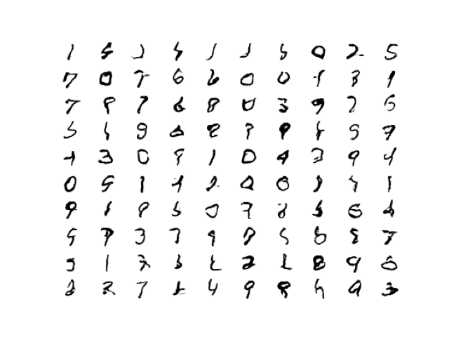
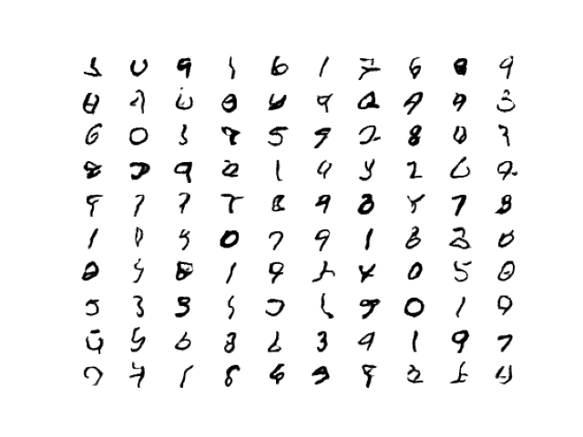
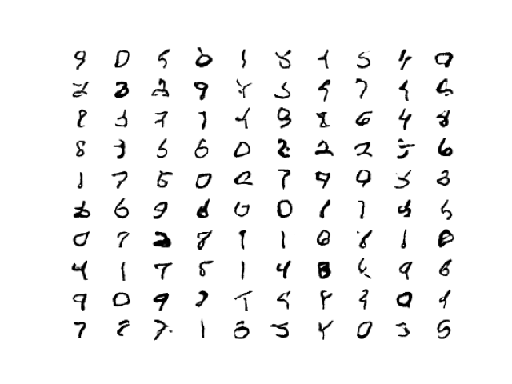
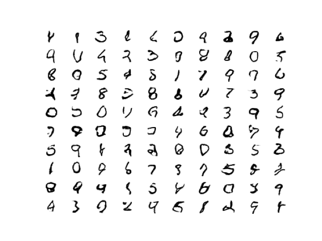

# This is a README for the DCGAN repo.

### In this repo we will create a GAN machine learning model with the MNIST Data Set
 

### Author - Ethan Zalta
 

## File Structure

* dcgan/
    * dcgan_base/ - contains log file and jupyter notebook
        * models/ - contains model from every 10th epoch
        * pngs/ - contains a 10 image x 10 image selection of generated numbers from every 10th epoch
    * dcgan_experiment_1/ - contains log file and jupyter notebook
        * models/ - contains model from every 10th epoch
        * pngs/ - contains a 10 image x 10 image selection of generated numbers from every 10th epoch
    * dcgan_experiment_2/ - contains log file and jupyter notebook
        * models/ - contains model from every 10th epoch
        * pngs/ - contains a 10 image x 10 image selection of generated numbers from every 10th epoch
    * dcgan_experiment_3/ - contains log file and jupyter notebook
        * models/ - contains model from every 10th epoch
        * pngs/ - contains a 10 image x 10 image selection of generated numbers from every 10th epoch

## Tests

##### Base Model
This model is just creating a basic working version of a DCGAN with the MNIST dataset.

##### Experiment 1 Model
In this version I added more layers into the generator with the hope of making the image genrator more accurate.

##### Experiment 2 Model
In this version I lowered the batch size from 256 to 128 as well as changed the learning rate from .0002 to a learning rate which adjusts from .0005 to .0001 after 50 epochs.

##### Experiment 3 Model
In this final version I implemented mixed precision to see what the differences would be in precision tuning./

## Images at end of training (Epoch 100)

##### Base Model

##### Experiment 1 Model

##### Experiment 2 Model

##### Experiment 3 Model

